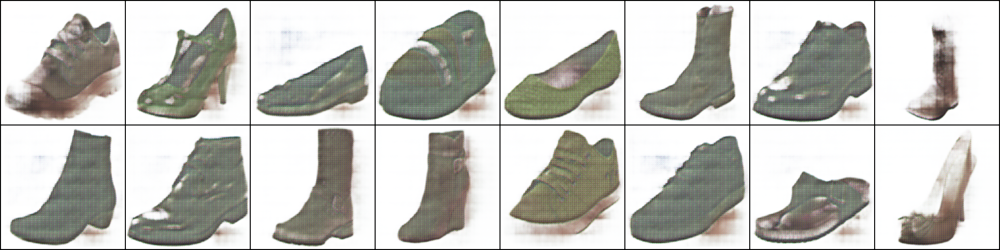

# Sketch-to-Shoe
Project Sketch-to-Shoe is a thorough yet comprehensible reimplementation of the pix2pix GAN paper (Isola et al.) which can be found [here](https://arxiv.org/pdf/1611.07004.pdf). It adheres to the PyTorch framework and is trained on various sketches/images of shoes.

The dataset, called Edges2Shoes has been obtained from [here](https://www.kaggle.com/balraj98/edges2shoes-dataset) and has been boiled down to contain a total of 2,392 training images along with 200 validation images. To sum it all up, project sketch-to-shoe transforms outlines/sketches of any given footwear design to a realistic copy of the same.

## Intuition behind pix2pix
The pix2pix GAN is used for image to image translation and project Sketch-to-Shoe makes use of the same to visualize realistic images of shoes from their respective edge maps(i.e. sketches)

__Model Architectures:__
The discriminator's architecture follows that of a PatchGAN with NxN or 15x15 patches(for edges2shoes data) which runs over the images in order to classify each patch as real or fake. According to the paper, this approach (patchGAN) is smaller, has fewer parameters during training and runs faster with respect to large images.

The generator's architecture is similar to that of a U-net and consists of the encoder-decoder structure in which the encoder down-samples images to 1x1 dimensions whereas the decoder up-samples them back to their original size which is 256x256 in case of the edges2shoes dataset.

__Loss Function:__
The entire loss function resembles that of a typical Generative Adversarial Network. As can be seen in the image below, the Discriminator is conditional in nature and thus also accepts x as an input so as to learn mappings from the inputs to the noise(generator's output) or actual image data for better results.

  

The L1 loss has been incorporated with the Generator's objective as the generator will then not only aim to fool the discriminator but will also try to mimic the ground truth as closely as possible, while producing outputs.

## Implementation details
- The images from the original dataset are arranged in such a manner that both the sketch and its image are placed side-by-side.
- The data had to be split into 2 halves in order to assign inputs and outputs to the two models.

- The models have been built using 2 different architectures: A patchGAN for the discriminator and a UNET for the generator.
- The patchGAN model accepts 2 inputs: sketch and image
- The U-net accepts only the images.
- The model has been trained for 25 whole epochs (using a GPU) on batches of size 16.
- Mixed precision training was observed to be faster and left a less costly memory footprint. It used the Automatic Mixed Precision training available as [torch.cuda.amp](https://pytorch.org/docs/stable/amp.html) and this employed FP16 precision during the training process.
- Various necessary(editable) hyperparameters have been stored in the config.py file in order to better organize the training code
- Various validation set images were passed through the generator in order to observe the progress of training loop.
- The models' states (upon completion of training) have been stored inside the 'models' folder for easier access during inference.
- The save.py file offers two functions that aid users in saving sample images and also their model's details.

## Results
__Final Loss Values:__
Discriminator loss: 4.745188419974511e-08
Generator loss: 8.940245628356934

__Image Samples:__
Samples of images generated 5th epoch through training:

Samples of images generated halfway through training:

Samples of images generated 20th epoch through training:

Samples of images generated after entire training process is complete:

Note: As can be seen, images generated aren't as close to reality as would be expected due to various computational limitations faced - Memory related issues prevented usage of larger datasets, GPU RAM related issues prevented training for more number of epochs, etc.

## References
1. The original paper: https://arxiv.org/pdf/1611.07004.pdf
2. The original and official paper implementation: https://github.com/phillipi/pix2pix
3. Helpful tutorials and blogs:
    - https://www.youtube.com/watch?v=9SGs4Nm0VR4
    - https://machinelearningmastery.com/a-gentle-introduction-to-pix2pix-generative-adversarial-network/
    - https://www.youtube.com/watch?v=SuddDSqGRzg
    - https://affinelayer.com/pixsrv/
    - https://www.youtube.com/watch?v=u7kQ5lNfUfg

## Potential web application
Built a Streamlit based web application by integrating both generator and discriminator models for accepting an input sketch and generating the real-life version of the same but as observed, the app requires well trained models for generating accurate representations. The code for the application can be accessed under app.py file.

Note: It requires an additional dependency called streamlit canvas for allowing users to sketch on their screens which is then fed as the input for the generator to produce a realistic image.

## Contributor

<td width:25%>

Pooja Ravi

</td>

## License
MIT © Pooja Ravi

This project is licensed under the MIT License - see the [License](LICENSE) file for details

